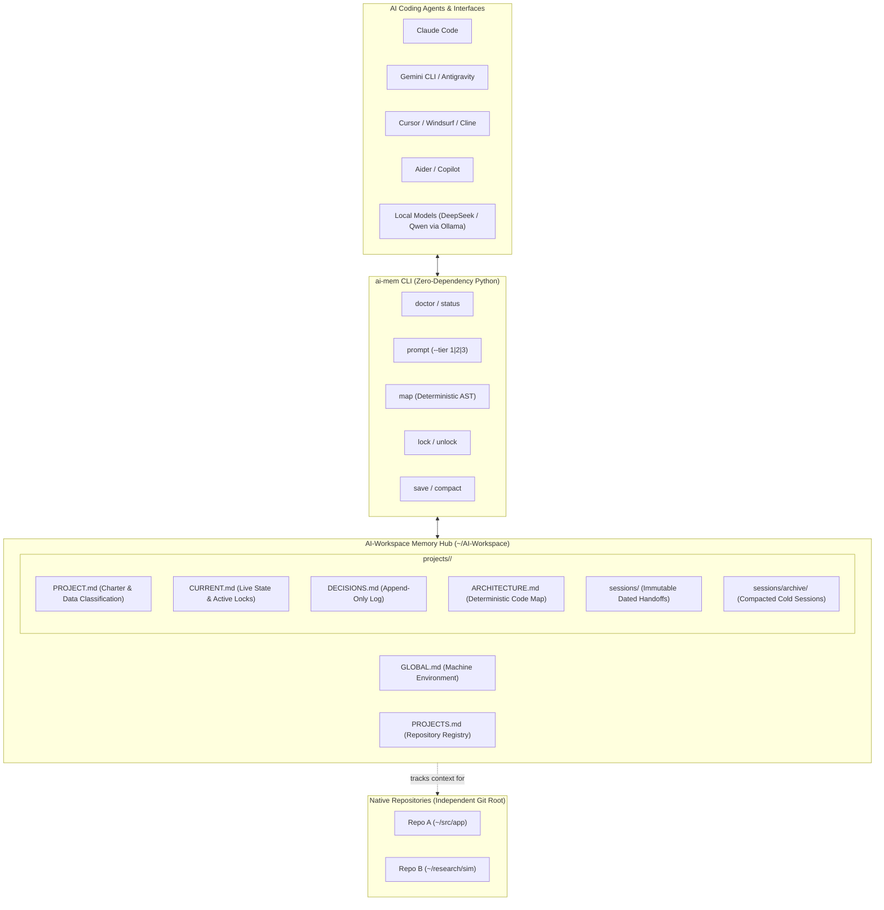

# AI-Workspace: Multi-Model Agent Memory & Workflow System

<p align="center">
  
  
  
  
  
</p>

A lightweight, vendor-agnostic, file-based memory and workflow coordination layer for AI coding agents (**Claude Code**, **Gemini CLI / Antigravity**, **Cursor**, **Aider**, **Codex**, **GitHub Copilot**, and local models via **Ollama** / **vLLM**).

AI-Workspace provides the missing coordination layer that allows multiple frontier and local AI models across multiple devices (laptops, workstations, HPC clusters) to collaborate on the same repositories without losing context, suffering from context rot, or leaking private data.

---

## Why AI-Workspace?

| Challenge | Without AI-Workspace | With AI-Workspace |
|---|---|---|
| **Multi-Model Collaboration** | Context is trapped in siloed vendor chats (Claude doesn't know what Cursor or Gemini did). | Centralized, vendor-neutral Markdown memory hub shared across all models. |
| **Multi-Device Mobility** | Switching between workstation, laptop, or cluster loses session state. | Framework and tooling sync seamlessly across machines via Git. |
| **Context Window Rot** | Massive unpruned chat logs blow up token budgets and degrade reasoning quality. | Automated session compaction (`ai-mem compact`) keeps memory lean and sharp. |
| **Agent Collisions** | Concurrent agents or team members edit conflicting files unknowingly. | Atomic workstream locking (`ai-mem lock`) in `CURRENT.md` prevents collisions. |
| **Token Cost & Latency** | Burning thousands of LLM tokens on every run just to discover project structure. | Deterministic AST code mapping (`ai-mem map`) creates module diagrams at $0 cost. |
| **Data Privacy & Leaks** | Sensitive lab data, secrets, or proprietary code accidentally ingested by cloud LLMs. | Strict air-gap classification (`local-only` fail-closed) and secret sanitization boundaries. |
| **Infrastructure Overhead** | Fragile vector databases, background daemons, or docker containers. | Zero dependencies—runs on pure Python standard library and POSIX conventions. |

---

## Architecture Overview



---

## ⚡ Quickstart: Setup on Any Device (1 Command)

Run this one-liner on any Linux, macOS, or WSL system:

```bash
git clone https://github.com/hitheshrai/AI-Workspace.git ~/AI-Workspace && cd ~/AI-Workspace && ./install.sh
```

### What the installer does:
1. Validates standard Python 3.6+ availability.
2. Initializes local `GLOBAL.md` and `PROJECTS.md` templates if not already present.
3. Installs the universal `~/AGENTS.md` system guidelines into your `$HOME` directory.
4. Symlinks the `ai-mem` command-line utility into `~/.local/bin/`.

Verify your installation with one diagnostic command:
```bash
ai-mem doctor
```
```text
==========================================================
               AI-Workspace Doctor Diagnostic             
==========================================================
✅ Workspace directory: /home/user/AI-Workspace
✅ Universal agent rules: /home/user/AGENTS.md
✅ Projects registry: PROJECTS.md (Registered projects verified)
Diagnostic complete: 0 error(s), 0 warning(s).
==========================================================
```

---

## 🚀 Daily Workflow Guide

### 1. Register a Repository
Navigate to any existing or new project repository and link it to the memory hub:
```bash
cd /path/to/my-repo
ai-mem init my-repo
```
*Creates `projects/my-repo/` inside `~/AI-Workspace` and automatically registers it in `PROJECTS.md`.*

---

### 2. Auto-Inject IDE & Tool Rules
Automatically configure your IDE or toolchain to respect the shared memory hierarchy:
```bash
ai-mem inject all        # Configures Cursor, Aider, Claude Code, and Copilot
```
Or configure specific tools individually:
* `ai-mem inject cursor` &rarr; Generates `.cursor/rules/agent-memory.mdc`
* `ai-mem inject aider` &rarr; Generates `.aider.conf.yml`
* `ai-mem inject claude` &rarr; Generates `CLAUDE.md`
* `ai-mem inject copilot` &rarr; Generates `.github/copilot-instructions.md`

`inject` never overwrites an existing integration file. Review or merge an
existing configuration manually before rerunning it.

---

### 3. Scan & Map Codebase Architecture (Zero Token Spend)
Generate an instant structural map of your codebase symbols (Python classes, functions, and file inventory) using deterministic AST parsing:
```bash
ai-mem map
```
*Outputs directly into `projects/<repo>/ARCHITECTURE.md` without consuming LLM tokens or running external embedding APIs.*

---

### 4. Prevent Collisions with Concurrency Locking
If multiple agents (or team members across multiple devices) work simultaneously, acquire a workstream lock before active editing:
```bash
# Acquire lock before active editing
ai-mem lock "refactor-auth"

# Release lock when complete
ai-mem unlock "refactor-auth"
```
*Locks are visibly tracked in `CURRENT.md` under `## Active Workstreams`.
Updates use an advisory file lock and atomic replacement, so concurrent
`ai-mem` clients on the same shared filesystem do not lose one another's
entries. Agents must still acquire a lock before editing for this convention to
prevent collisions.*

---

### 5. Running Any Model Seamlessly

#### With Claude Code or Gemini CLI / Antigravity
Launch the CLI directly inside your project repository. The agent automatically detects `~/AGENTS.md`, resolves the project memory in `~/AI-Workspace`, and reads `CURRENT.md` before taking action.

#### With Cursor, Windsurf, or Cline
Open your project in the editor. The injected rule automatically feeds `CURRENT.md` into the agent's context for every edit.

#### With Local Models via Ollama (DeepSeek-Coder, Qwen2.5, Llama-3)
Use tiered context budgeting to fit any model's context window:

```bash
# Tier 1: Frontier Models (Full Project Charter + Decisions + Current State)
ai-mem prompt --tier 1

# Tier 2: Mid-Weight Models (32B / 70B: High-level Scope + Current State)
(ai-mem prompt --tier 2 && echo "Task: implement redis cache") | ollama run qwen2.5-coder:32b

# Tier 3: Edge & Fast Models (7B / 14B: Compact Immediate State < 500 Tokens)
(ai-mem prompt --tier 3 && echo "Task: write unit tests") | ollama run deepseek-coder:6.7b
```

For a cloud-bound context packet, name the route explicitly. `local-only` and
unknown projects are rejected; `cloud-approved` projects must name a provider
listed in their `PROJECT.md`.

```bash
ai-mem prompt --route cloud --provider approved-provider
```

---

### 6. Timeline Audit: Review Multi-Model History
Check recent sessions and model contributions right from your terminal:
```bash
ai-mem log -n 5
```
```text
Recent 3 sessions for my-repo:
---------------------------------------------------------------------------
📅 2026-09-23 | 🤖 antigravity | 🧠 gemini-3.8-flash | ✅ completed 
   Task: Verify static reference & submit AIMD production run
---------------------------------------------------------------------------
📅 2026-09-23 | 🤖 claude     | 🧠 claude-opus-5-5  | ✅ completed 
   Task: Diagnose convergence timeout & submit ALGO=Normal retry
---------------------------------------------------------------------------
📅 2026-09-22 | 🤖 codex      | 🧠 gpt-4o           | ✅ completed 
   Task: Implement AST structural codebase scanner
---------------------------------------------------------------------------
```

---

### 7. Ending a Session & Compacting History
When wrapping up work, prompt your agent with *"Save the session"* or run:
```bash
ai-mem save
```
*Interactively scaffolds an immutable session record capturing Git commit, branch, actions taken, verification results, and next steps.*

#### Mitigating Context Rot
As sessions accumulate, keep active context fast and relevant by archiving cold sessions:
```bash
ai-mem compact --keep 5
```
*Keeps the 5 most recent sessions active in `sessions/` and automatically moves older history to `sessions/archive/`.*

---

## 🛠️ CLI Reference Table

| Command | Arguments | Purpose |
|---|---|---|
| `ai-mem doctor` | — | Runs workspace health check (verifies paths, registry syntax, and repo alignment). |
| `ai-mem status` | — | Displays active Git context and memory alignment side by side. |
| `ai-mem init` | `<slug>` | Bootstraps project memory directory and registers repository in `PROJECTS.md`. |
| `ai-mem inject` | `cursor` \| `aider` \| `claude` \| `copilot` \| `all` | Generates tool configuration pointers inside active repository. |
| `ai-mem map` | — | Deterministic AST codebase scanner generating `ARCHITECTURE.md` (0 tokens). |
| `ai-mem lock` | `<workstream>` | Registers active lock in `CURRENT.md` to prevent multi-agent collision. |
| `ai-mem unlock` | `<workstream>` | Releases workstream lock from `CURRENT.md`. |
| `ai-mem prompt` | `[--tier 1\|2\|3] [--route local\|cloud] [--provider NAME]` | Generates tiered prompt context. Cloud routes enforce the recorded classification. |
| `ai-mem log` | `[-n N]` | Displays formatted terminal timeline of the last $N$ agent sessions. |
| `ai-mem save` | — | Interactively records an immutable session handoff record. |
| `ai-mem compact` | `[--keep N]` | Moves older sessions to `sessions/archive/` to mitigate context rot. |

---

## 📂 Repository & Memory Structure

```text
~/AI-Workspace/
├── install.sh                  # One-command universal installer
├── README.md                   # Complete system documentation
├── GLOBAL.md.example           # Machine environment template
├── PROJECTS.md.example         # Project registry template
├── RETRIEVAL.md                # Search policies & context budgets
├── MODEL_ROUTING.md            # Data classification & privacy rules
├── INTEGRATIONS.md             # Integration roadmap
├── bin/
│   ├── ai-mem                  # Zero-dependency Python CLI tool
│   └── init-project-memory     # Scaffolding helper script
├── templates/                  # Canonical Markdown memory templates
│   ├── AGENTS.md               # Universal instructions for user $HOME
│   ├── PROJECT.md              # Project charter & classification
│   ├── CURRENT.md              # Live status, locks, and next actions
│   ├── DECISIONS.md            # Append-only architectural log
│   ├── EXPERIMENTS.md          # Append-only benchmark / run log
│   └── SESSION_HANDOFF.md      # Template for session handoff records
└── projects/                   # (Ignored from public Git)
    └── <project-slug>/         # Centralized memory for individual repos
        ├── PROJECT.md
        ├── CURRENT.md
        ├── DECISIONS.md
        ├── ARCHITECTURE.md
        └── sessions/
            ├── <session-id>.md
            └── archive/
```

---

## 🔒 Privacy, Security & Data Boundaries

1. **Air-Gapped Data Safety**: All private project memory (`projects/`), raw data, logs, and machine environments (`GLOBAL.md`, `PROJECTS.md`) are strictly `.gitignore`d. Only the portable tooling, installer, and templates are tracked in Git.
2. **Data Classification**: Every project defines its classification in `PROJECT.md` (`public`, `internal`, or `restricted-confidential`). Tasks marked `local-only` fail closed—they will never fall back to a cloud model.
3. **Secret Sanitization**: `ai-mem save` and `ai-mem prompt` apply a built-in, pattern-based filter to known API keys, passwords, tokens, private keys, and credential URLs. This is defense in depth, not a substitute for keeping sensitive content out of cloud prompts.

---

## 🤝 Contributing

Contributions, bug reports, and suggestions are welcome!
1. Fork the repository on GitHub: [hitheshrai/AI-Workspace](https://github.com/hitheshrai/AI-Workspace).
2. Create a feature branch (`git checkout -b feature/my-feature`).
3. Commit your changes (`git commit -m "Add feature"`).
4. Push to your branch (`git push origin feature/my-feature`).
5. Open a Pull Request.

---

## 📄 License

This project is licensed under the [MIT License](LICENSE).
